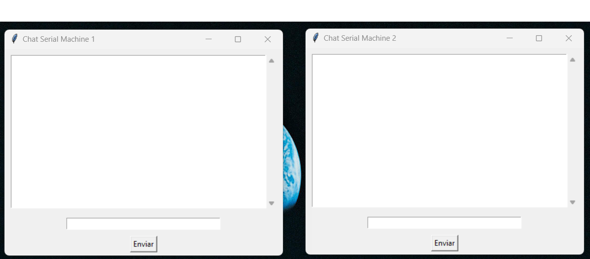
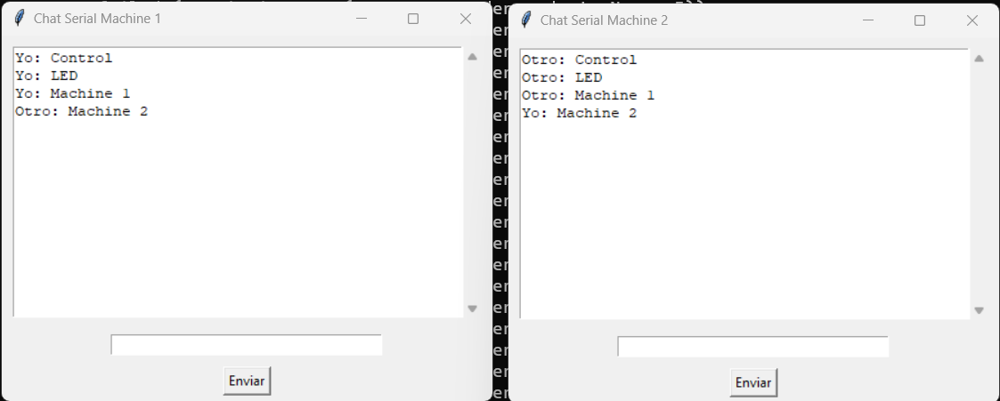
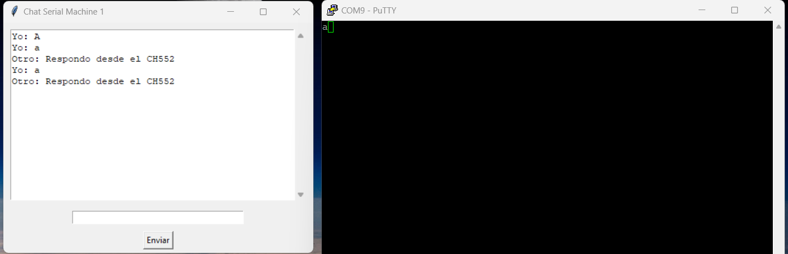

## CH552: Conversor USB  a TTL
***Creación de una Interfaz USB a TTL con el Microcontrolador CH552***

**Introducción:**

Bienvenido al repositorio dedicado a la configuración y ejemplos de uso de la comunicación USB a TTL utilizando el microcontrolador CH552. En este repositorio, encontrarás información detallada y ejemplos prácticos que te ayudarán a establecer una conexión bidireccional entre tu computadora y el microcontrolador CH552 a través de una interfaz USB a TTL.

El microcontrolador CH552 ofrece una amplia gama de capacidades y aplicaciones, y una de sus características destacadas es la capacidad de comunicación USB. Esto te permite crear dispositivos que pueden ser controlados y monitoreados desde tu computadora, lo que es esencial en proyectos de desarrollo, prototipado y automatización.
```
// Conexión CH552 Serial TX RX:
// -------                                 CH552
//                                          +--\/--+
//                   ---------------- P32  1|°     |16  V33 -------------
//                   ---------------- P14  2|      |15  Vcc -------------
//                   ---------------- P15  3|      |14  GND -------------
//                   ---------------- P16  4|      |13  P37 UDM --- USB D-
//                   ---------------- P17  5|      |12  P36 UDP --- USB D+
//                   ---------------- RST  6|      |11  P34 -------------
//                     TX ----------- P31  7|      |10  P33 -------------
//                     RX ----------- P30  8|      |9   P11 -------------
//                                          +------+
```
## Documentación

En esta sección se detalla la configuración paso a paso para establecer la conexión USB a TTL con el CH552.

Para ello se hace uso del código ejemplo proporcionado por la API desarrollada por [ch55xduino](https://github.com/DeqingSun/ch55xduino).
 
Para una mejor compresión referente a la instalación te recomendamos ver nuestra, guía de instalación [Aquí]()

***Verificación de código***

* Abre el ejemplo USBSerilalAdaptor.ino  desde Archivo->Ejemplos->04. Comunicación -> USBSerilalAdaptor

## Ejemplo práctico

**Comunicación uno a uno: Explorando la Comunicación entre Computadoras**

En el contexto de la comunicación uno a uno entre computadoras, se presenta un ejemplo ilustrativo que utiliza el CH552 en combinación con un convertidor USB TTL. Este enfoque resulta especialmente útil en situaciones donde no se disponga de otros dispositivos USB seriales para facilitar la comunicación.

El propósito de esta configuración es establecer una comunicación directa entre dos computadoras. Para lograrlo, se emplea el CH552, un componente que desempeña un papel crucial en la interconexión. Junto con el convertidor USB TTL, se establece un vínculo robusto y confiable.

En escenarios donde la disponibilidad de otros dispositivos USB seriales es limitada o inexistente, esta solución adquiere un valor significativo. Permite que dos computadoras se comuniquen entre sí sin depender de recursos externos, facilitando el intercambio de información y datos de manera eficiente.

 Por ello se propone el uso de dos interfaces de comunicación para la verificación del funcionamiento, un [chat](Software/interface_Serial) a partir de la comunicación serial.
 
 


 ```
    \\                  ─────────▄▲▲▲────────
    \\                  ─────▄█▀▌██████▄──────
    \\                  ────▐███▌███████▐▄────
    \\                  ─────▀██▌▄▐███▌▄▐██▐▌▀
    \\                  ─────────█─────█──────
 

 \\          _______________                            _______________  
 \\         |  ___________  |                          |  ___________  |    
 \\         | |           | | CH552            FTDI    | |           | |
 \\         | | >Hola     | | ------+         +------- | | >Hola     | |
 \\         | |           | |       |         |        | |           | |
 \\         | |           | |     RX|___  ____|RX      | |           | |
 \\         | |___     ___| |       |   \/    |        | |___________| |
 \\         |_____|\_/|_____|     TX|___/\____|TX      |_______________|
 \\           _|__|/ \|_|_          |         |            _|________|_
 \\          / ********** \  ------+         +--------   / ********** \
 \\         /  ************ \                           /  ************  \
```
**Prueba de funcionamiento**

 

Si bien no solo se puede usar como un convertidor USB a TTL, sino también puede introducir ciertas secciones de código para realizar ciertas funciones independientes. 

Para instalar la interfaz es necesario la biblioteca de pyserial, para hacer uso de puertos seriales COM disponibles. 

 >pip install pyserial

**Agregando funcionalidad al CH552 adaptador**

El convertidor USB a TTL CH552, permite elaborar rutinas internas como secuencia de encendido de led o respuesta de algún parámetro se desee visualizar, ejecutar internamente del microcontrolador.

El código de [ch552-USB-TTL](Software/UsbSerialAdaptor2/UsbSerialAdaptor2.ino)permite establecer las rutinas personalizadas realizando las adecuaciones necesarias al código ejemplo dado por el desarrollador.

 

## Recursos Adicionales

Para mayor información, estos son algunos proyectos que usan la configuración del ch55x.

* [CH55xduino](https://github.com/DeqingSun/ch55xduino)

* [CH552-USB-OLED](https://github.com/wagiminator/CH552-USB-OLED)

* [CH552E MacroPad mini](https://github.com/wagiminator/CH552-Macropad-mini)

 **Información Previa**

 * [Configurando_tu_entorno](https://github.com/UNIT-Electronics/CH552-en-Arduino/)

 **Proyecto que te puede interesar**

 * [Oled_CH552](https://github.com/UNIT-Electronics/OLED_ch552)
 
Estamos emocionados de presentarte esta colección de información y ejemplos que te ayudarán a aprovechar al máximo las capacidades del microcontrolador CH552 en términos de comunicación USB a TTL. Ya sea que seas un principiante en la programación de microcontroladores o un experto experimentado, esperamos que encuentres este repositorio útil y enriquecedor para tus proyectos.

No dudes en explorar el contenido, clonar el repositorio y experimentar con los ejemplos proporcionados. ¡Te deseamos mucho éxito en tu viaje de aprendizaje y desarrollo con el microcontrolador CH552 y la comunicación USB a TTL!

